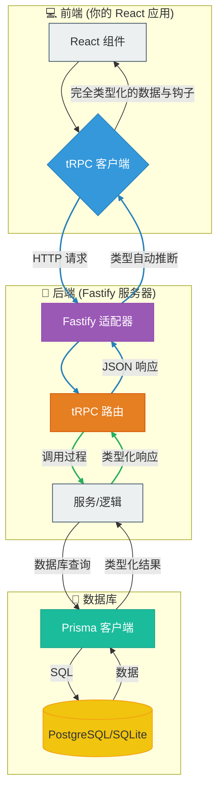

# 后端架构设计

## 1\. 引言与设计理念

### 目的

本文档旨在为构建现代化、可扩展且类型安全的后端提供架构理念和推荐技术栈，以补充 “Carrot Web Game Template”。其主要目标是创建一个优先考虑**开发者体验**和**强大性能**的蓝图。

### 核心原则

  - **端到端的类型安全**：通过确保类型从数据库无缝流向后端，并一直延伸到前端的 React 组件，来消除一大类运行时错误。你在数据库中查询什么，就能保证在客户端得到什么。
  - **高性能**：利用低开销、高吞吐量的 Web 框架高效处理请求，确保后端永远不会成为瓶颈。
  - **开发者体验**：最大限度地减少样板代码和手动类型处理。开发过程应该感觉快速、直观、愉快，并拥有出色的自动补全和清晰的错误信息。
  - **模块化与可扩展性**：架构的组织方式应易于理解、维护和扩展，以适应项目的增长。

## 2\. 推荐技术栈

| 层级 | 技术 | 原因 |
|---|---|---|
| **框架** | [**Fastify**](https://www.fastify.io/) | 性能极快，开销极小。其基于插件的架构功能强大，并提供一流的 TypeScript 支持。 |
| **API 层** | [**tRPC**](https://trpc.io/) | 我们类型安全方法的核心。它**无需代码生成**，让你可以像从前端调用本地函数一样编写 API 端点。 |
| **数据库 ORM** | [**Prisma**](https://www.prisma.io/) | 新一代 ORM，可根据你的 schema 提供完全类型安全的数据库客户端。它使数据库查询变得直观和安全。 |
| **数据库** | [**PostgreSQL**](https://www.postgresql.org/) / [**SQLite**](https://www.sqlite.org/index.html) | PostgreSQL 用于生产环境的稳健性；SQLite 用于零配置、基于文件的本地开发和简单原型。Prisma 无缝支持这两种数据库。 |

## 3\. 数据流图

此图说明了数据和类型如何在整个技术栈中流动，从而创建了一个统一、连贯的系统。

-----

-----
